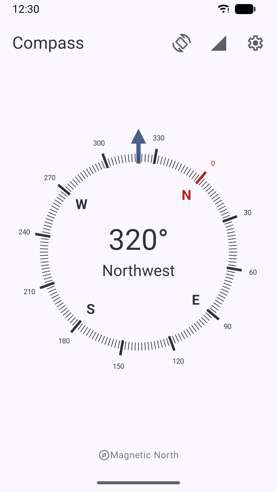
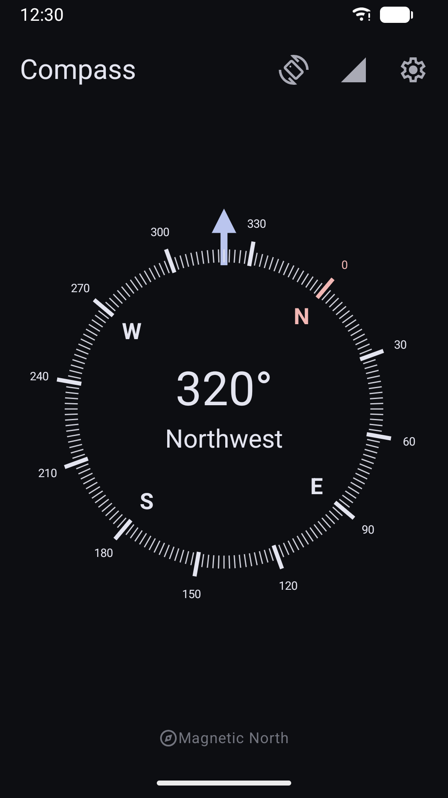

# Compass

### A simple and clean compass for Android

This project aims to provide a clean and reliable compass for Android.

## Features

* Can point to magnetic north as well as true north
* Shows exact degrees and cardinal direction
* Displays sensor status
* Haptic feedback
* Light and dark theme
* No advertisements
* No trackers
* No unnecessary permissions

## Screenshots

## Translations

Help translate the app into your language on [Weblate](https://hosted.weblate.org/engage/compass/).

## License

This project is licensed under the GNU GPL v3.
See the [LICENSE](LICENSE) file for the full license text.
